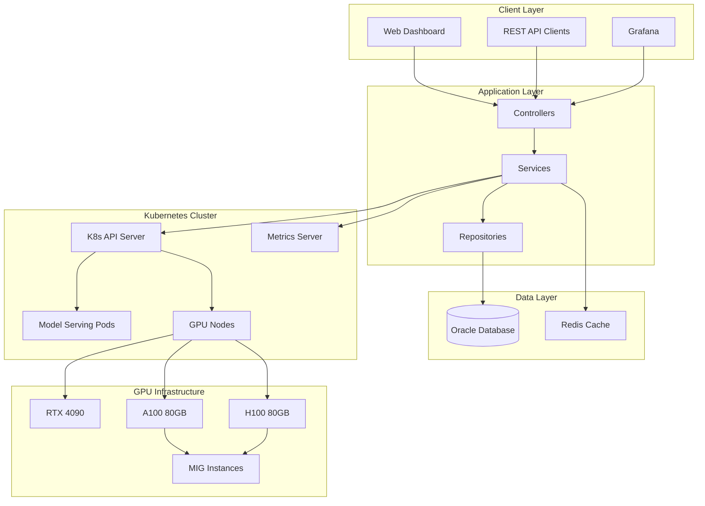
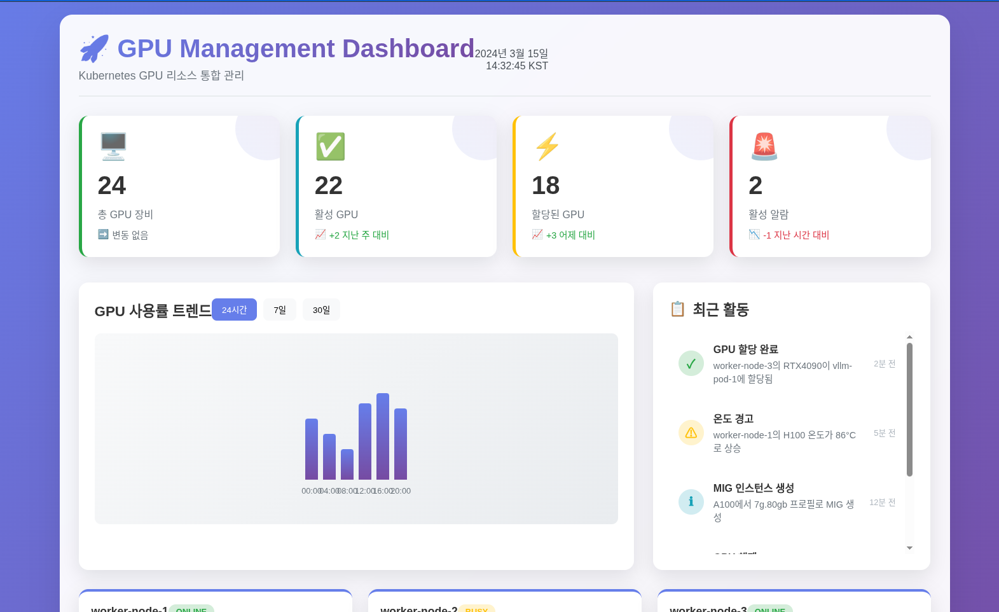
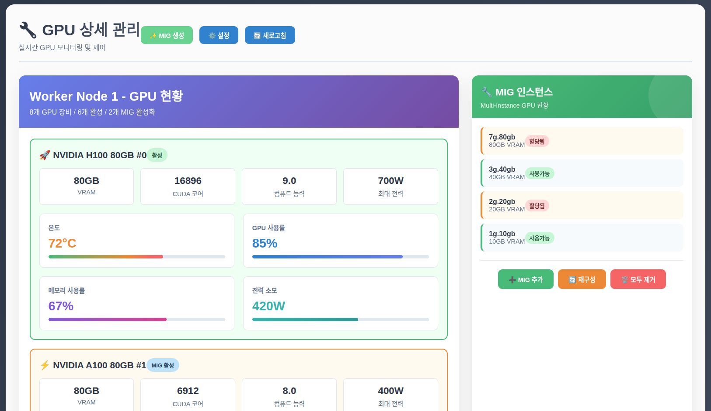
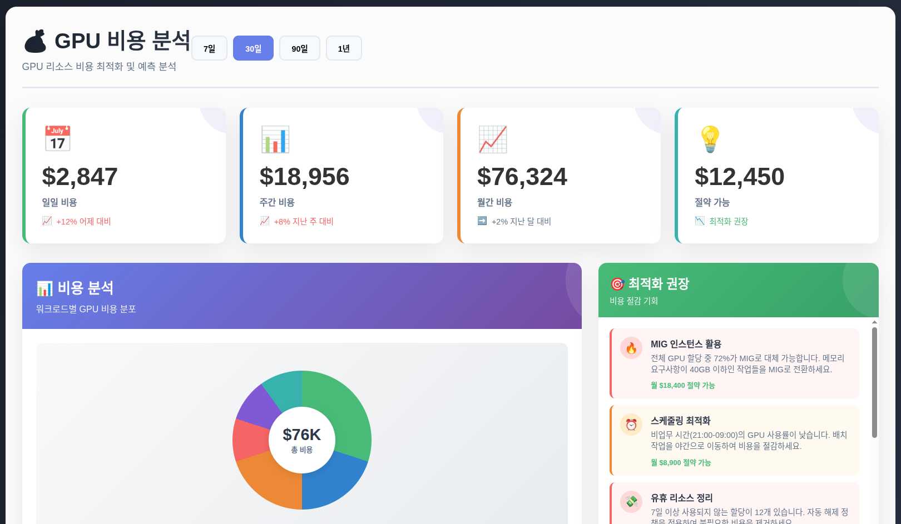

# 🚀 K8s GPU Management System

[](https://spring.io/projects/spring-boot)
[](https://www.oracle.com/database/)
[](https://kubernetes.io/)
[](https://openjdk.java.net/)
[](LICENSE)

> **vLLM & SGLang 모델 서빙을 위한 지능형 GPU 리소스 관리 플랫폼**

Kubernetes 환경에서 다양한 GPU 리소스(GTX 1080부터 H100까지)를 효율적으로 관리하고, MIG(Multi-Instance GPU) 기능을 활용하여 비용을 최적화하는 통합 모니터링 시스템입니다.

## 📋 목차

- [주요 기능](#-주요-기능)
- [지원 GPU 모델](#-지원-gpu-모델)
- [시스템 아키텍처](#-시스템-아키텍처)
- [빠른 시작](#-빠른-시작)
- [설치 가이드](#-설치-가이드)
- [API 문서](#-api-문서)
- [대시보드](#-대시보드)
- [설정](#-설정)
- [모니터링](#-모니터링)
- [문제 해결](#-문제-해결)
- [기여하기](#-기여하기)
- [라이선스](#-라이선스)

## 🎯 주요 기능

### 📊 실시간 GPU 모니터링
- **다양한 GPU 모델** 통합 관리 (14종 지원)
- **실시간 메트릭** 수집 (사용률, 온도, 전력, 메모리)
- **MIG 인스턴스** 관리 (H100, A100)
- **과열 및 이상 상태** 자동 감지

### 🎮 지능형 리소스 할당
- **자동 GPU 할당** 시스템
- **워크로드 기반** 최적 리소스 매칭
- **MIG 파티셔닝** 자동 관리
- **비용 기반** 할당 최적화

### 💰 비용 관리 및 최적화
- **실시간 비용 추적**
- **팀/프로젝트별** 비용 분석
- **사용 패턴 기반** 최적화 제안
- **예산 관리** 및 알람

### 📈 예측 분석
- **사용량 트렌드** 분석
- **용량 계획** 수립 지원
- **비용 예측** 및 예산 계획
- **성능 벤치마크** 관리

## 🎮 지원 GPU 모델

### Gaming Series
| 모델 | 메모리 | 아키텍처 | MIG 지원 | 상태 |
|------|--------|----------|----------|------|
| GTX 1080 | 8GB | Pascal | ❌ | EOL |
| GTX 1080 Ti | 11GB | Pascal | ❌ | EOL |
| Titan Xp | 12GB | Pascal | ❌ | EOL |
| RTX 2080 | 8GB | Turing | ❌ | Active |
| RTX 2080 Ti | 11GB | Turing | ❌ | Active |
| RTX 3080 | 10GB | Ampere | ❌ | Active |
| RTX 3090 | 24GB | Ampere | ❌ | Active |
| RTX 4080 | 16GB | Ada Lovelace | ❌ | Active |
| RTX 4090 | 24GB | Ada Lovelace | ❌ | Active |

### Professional/Datacenter Series
| 모델 | 메모리 | 아키텍처 | MIG 지원 | 최대 MIG 인스턴스 |
|------|--------|----------|----------|-------------------|
| Tesla V100 16GB | 16GB | Volta | ❌ | - |
| Tesla V100 32GB | 32GB | Volta | ❌ | - |
| A100 PCIe 40GB | 40GB | Ampere | ✅ | 7 |
| A100 SXM4 80GB | 80GB | Ampere | ✅ | 7 |
| H100 PCIe 80GB | 80GB | Hopper | ✅ | 7 |

### MIG 프로필 지원
```
H100/A100 MIG 프로필:
├── 1g.10gb  - 1 compute slice, 10GB memory (7 instances)
├── 2g.20gb  - 2 compute slices, 20GB memory (3 instances)  
├── 3g.40gb  - 3 compute slices, 40GB memory (2 instances)
└── 7g.80gb  - 7 compute slices, 80GB memory (1 instance)
```

## 🏗️ 시스템 아키텍처



## 🚀 빠른 시작

### 전제 조건

- Java 17+
- Spring Boot 3.2+
- Oracle Database 19c+
- Kubernetes 1.25+
- Docker & Docker Compose
- NVIDIA GPU 드라이버
- nvidia-container-toolkit

### 1분 데모 실행

```bash
# 1. 프로젝트 클론
git clone https://github.com/your-org/k8s-gpu-management.git
cd k8s-gpu-management

# 2. Docker Compose로 실행
docker-compose up -d

# 3. 웹 대시보드 접속
open http://localhost:8080/k8s-monitor

# 4. GPU 정보 확인
curl http://localhost:8080/k8s-monitor/api/v1/gpu/overview
```

## 📦 설치 가이드

### Option 1: Kubernetes 배포

```bash
# 1. 네임스페이스 생성
kubectl create namespace k8s-monitoring

# 2. Oracle 데이터베이스 설정
kubectl apply -f k8s/oracle-db.yaml

# 3. 애플리케이션 배포
kubectl apply -f k8s/gpu-monitor.yaml

# 4. 서비스 확인
kubectl get pods -n k8s-monitoring
```

### Option 2: 로컬 개발 환경

```bash
# 1. 환경 변수 설정
export SPRING_PROFILES_ACTIVE=development,gpu-management
export DB_HOST=localhost
export DB_USERNAME=gpu_admin
export DB_PASSWORD=password

# 2. 데이터베이스 초기화
./scripts/init-database.sh

# 3. 애플리케이션 실행
./mvnw spring-boot:run

# 4. 브라우저에서 확인
open http://localhost:8080/k8s-monitor
```

### Option 3: Production 배포

자세한 내용은 [설치 가이드](docs/installation.md)를 참조하세요.

## 📚 API 문서

### GPU 관리 API

#### 클러스터 개요
```http
GET /api/v1/gpu/overview
```

```json
{
  "totalGpuDevices": 24,
  "activeAllocations": 15,
  "totalMigInstances": 42,
  "overallGpuUtilization": 67.5,
  "devicesByModel": {
    "H100_80GB": 8,
    "A100_80GB": 12,
    "RTX4090": 4
  }
}
```

#### GPU 장비 조회
```http
GET /api/v1/gpu/devices?nodeName=worker-01
```

#### GPU 리소스 할당
```http
POST /api/v1/gpu/allocations
Content-Type: application/json

{
  "namespace": "model-serving",
  "podName": "vllm-llama2-7b",
  "workloadType": "Inference",
  "useMig": true,
  "requiredMemoryGb": 20
}
```

#### MIG 인스턴스 생성
```http
POST /api/v1/gpu/devices/{deviceId}/mig
Content-Type: application/json

["H100_2G20GB", "H100_3G40GB"]
```

전체 API 문서: [API Reference](docs/api.md)

## 🖥️ 대시보드

### 메인 대시보드


- **실시간 클러스터 상태** 모니터링
- **GPU 사용률** 및 **온도** 추적
- **비용 분석** 및 **예산 관리**
- **알람 및 이슈** 관리

### GPU 관리 화면


- **GPU 장비 인벤토리**
- **MIG 인스턴스 관리**
- **할당 현황** 추적
- **성능 메트릭** 시각화

### 비용 분석 화면


- **팀별/프로젝트별** 비용 분석
- **사용 패턴** 트렌드
- **최적화 제안**
- **예산 알람**

## ⚙️ 설정

### application.yml 설정

```yaml
# GPU 관리 설정
gpu:
  management:
    enabled: true
    
    # 지원 모델
    supported-models:
      - H100_80GB
      - A100_80GB
      - RTX4090
    
    # MIG 설정
    mig:
      enabled: true
      auto-cleanup: true
    
    # 메트릭 수집
    metrics:
      collection-interval: 30s
      retention-days: 30
    
    # 비용 설정
    cost:
      enabled: true
      default-rates:
        H100_80GB: 8.0
        A100_80GB: 6.0
        RTX4090: 2.0
```

### 환경별 설정

- **Development**: H2 인메모리 DB, 모의 GPU 데이터
- **Staging**: PostgreSQL, 제한된 GPU 풀
- **Production**: Oracle DB, 전체 GPU 클러스터

자세한 설정: [Configuration Guide](docs/configuration.md)

## 📊 모니터링

### Prometheus 메트릭

```prometheus
# GPU 사용률
gpu_utilization{device_id="worker-01-GPU-00", model="H100_80GB"} 85.2

# GPU 온도
gpu_temperature{device_id="worker-01-GPU-00"} 78.5

# MIG 할당률
mig_allocation_ratio{profile="2g.20gb"} 0.75

# 비용 메트릭
gpu_hourly_cost{team="ai-research", project="llm-training"} 48.0
```

### Grafana 대시보드

```bash
# Grafana 대시보드 import
curl -X POST http://grafana:3000/api/dashboards/db \
  -H "Content-Type: application/json" \
  -d @grafana/gpu-dashboard.json
```

### 알람 설정

```yaml
# 과열 알람
- alert: GPUOverheating
  expr: gpu_temperature > 85
  for: 5m
  annotations:
    summary: "GPU {{ $labels.device_id }} is overheating"

# 높은 사용률 알람
- alert: HighGPUUtilization
  expr: gpu_utilization > 95
  for: 10m
```

## 🔧 문제 해결

### 자주 발생하는 문제

#### 1. GPU 장비 인식 실패
```bash
# nvidia-smi 확인
nvidia-smi

# 드라이버 설치 확인
nvidia-container-cli info

# 권한 확인
ls -la /dev/nvidia*
```

#### 2. MIG 설정 오류
```bash
# MIG 모드 활성화
sudo nvidia-smi -mig 1

# MIG 인스턴스 생성
sudo nvidia-smi mig -cgi 1g.5gb

# 상태 확인
nvidia-smi -L
```

#### 3. 데이터베이스 연결 실패
```bash
# Oracle 연결 테스트
sqlplus gpu_admin/password@localhost:1521/ORCL

# 네트워크 확인
telnet oracle-db 1521
```

#### 4. 메트릭 수집 실패
```bash
# Pod 로그 확인
kubectl logs -f deployment/k8s-gpu-monitor -n k8s-monitoring

# 메트릭 서버 상태
kubectl get apiservice v1beta1.metrics.k8s.io
```

전체 문제 해결 가이드: [Troubleshooting](docs/troubleshooting.md)

## 🔒 보안

### RBAC 설정

```yaml
apiVersion: rbac.authorization.k8s.io/v1
kind: ClusterRole
metadata:
  name: gpu-monitor
rules:
- apiGroups: [""]
  resources: ["nodes", "pods"]
  verbs: ["get", "list", "watch"]
- apiGroups: ["metrics.k8s.io"]
  resources: ["nodes", "pods"]
  verbs: ["get", "list"]
```

### 데이터 보안

- **암호화된 데이터베이스** 연결
- **API 키 기반** 인증
- **감사 로깅** 활성화
- **네트워크 정책** 적용

## 📈 성능 최적화

### 데이터베이스 튜닝

```sql
-- 인덱스 최적화
CREATE INDEX idx_gpu_metrics_device_time 
ON gpu_usage_metrics(device_id, timestamp);

-- 파티셔닝
ALTER TABLE gpu_usage_metrics 
PARTITION BY RANGE (timestamp)
INTERVAL(NUMTOYMINTERVAL(1, 'MONTH'));
```

### 캐시 전략

```java
@Cacheable(value = "gpuDevices", key = "#nodeName")
public List<GpuDeviceInfo> getGpuDevicesByNode(String nodeName) {
    // 구현...
}
```

### 배치 처리

```yaml
gpu:
  management:
    metrics:
      batch-size: 500
      parallel-processing: true
```
