# K8s GPU Management 시스템 아키텍처

## 1. 시스템 개요

### 1.1 목적
K8s GPU Management 시스템은 Kubernetes 환경에서 GPU 리소스를 효율적으로 관리하고 모니터링하기 위한 통합 플랫폼입니다. vLLM과 SGLang 같은 LLM 서빙 워크로드에 최적화되어 있으며, GPU 할당, 비용 추적, 성능 모니터링 등의 기능을 제공합니다.

### 1.2 핵심 기능
- **GPU 장비 관리**: GPU 하드웨어 등록, 상태 모니터링, 라이프사이클 관리
- **MIG 관리**: NVIDIA MIG(Multi-Instance GPU) 인스턴스 생성, 할당, 관리
- **리소스 할당**: 동적 GPU 리소스 할당 및 스케줄링
- **비용 추적**: GPU 사용량 기반 비용 계산 및 최적화 제안
- **메트릭 수집**: 실시간 GPU 사용률, 온도, 전력 소모 모니터링
- **예측 분석**: AI 기반 용량 계획 및 사용량 예측

### 1.3 아키텍처 원칙
- **확장성**: 수천 개의 GPU를 지원하는 수평 확장 가능한 설계
- **고가용성**: 장애 허용성을 위한 다중화 및 복구 메커니즘
- **모듈성**: 독립적으로 배포 가능한 마이크로서비스 구조
- **표준 준수**: Kubernetes 네이티브 API 및 CNCF 표준 준수
- **보안**: 엔드투엔드 암호화 및 세밀한 접근 제어

## 2. 전체 시스템 아키텍처

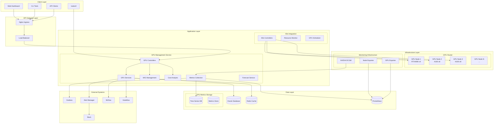

## 3. 상세 컴포넌트 아키텍처

### 3.1 애플리케이션 레이어

#### 3.1.1 GPU Management Core
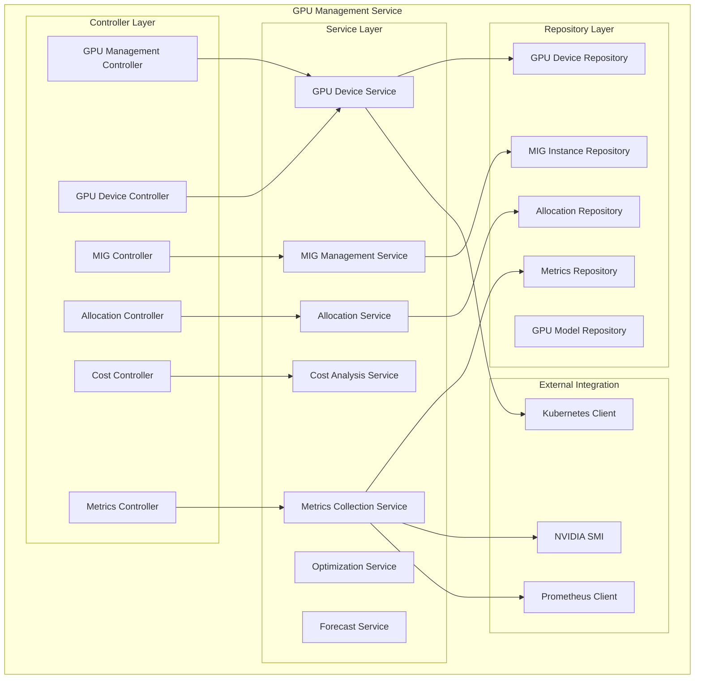

#### 3.1.2 데이터 모델
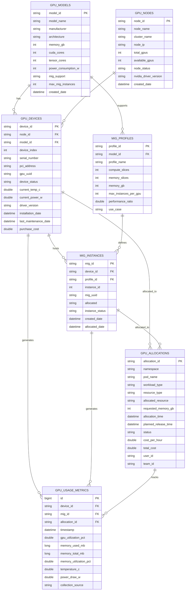

### 3.2 데이터 레이어 아키텍처

#### 3.2.1 데이터베이스 설계
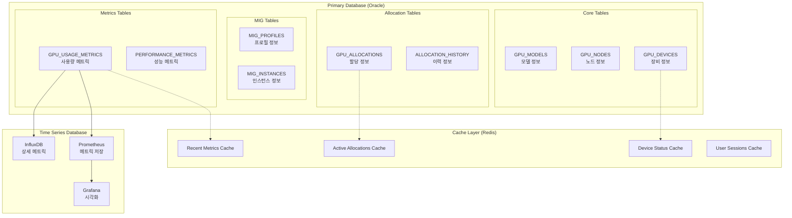

#### 3.2.2 데이터 파티셔닝 전략
```sql
-- 월별 파티셔닝 (GPU_USAGE_METRICS)
CREATE TABLE GPU_USAGE_METRICS (
    id NUMBER(19) NOT NULL,
    device_id VARCHAR2(50),
    timestamp TIMESTAMP,
    gpu_utilization_pct NUMBER(5,2),
    -- ... 기타 컬럼들
    PRIMARY KEY (id, timestamp)
) PARTITION BY RANGE (timestamp) (
    PARTITION metrics_202401 VALUES LESS THAN (DATE '2024-02-01'),
    PARTITION metrics_202402 VALUES LESS THAN (DATE '2024-03-01'),
    PARTITION metrics_202403 VALUES LESS THAN (DATE '2024-04-01'),
    -- ... 추가 파티션들
);

-- 인덱스 전략
CREATE INDEX idx_gpu_metrics_device_time 
ON GPU_USAGE_METRICS (device_id, timestamp) LOCAL;

CREATE INDEX idx_gpu_metrics_allocation 
ON GPU_USAGE_METRICS (allocation_id, timestamp) LOCAL;

-- 압축 설정
ALTER TABLE GPU_USAGE_METRICS COMPRESS FOR OLTP;
```

### 3.3 메트릭 수집 아키텍처

#### 3.3.1 메트릭 수집 파이프라인
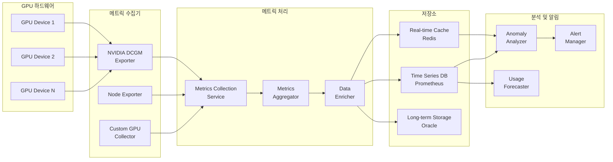

#### 3.3.2 메트릭 수집 상세 흐름
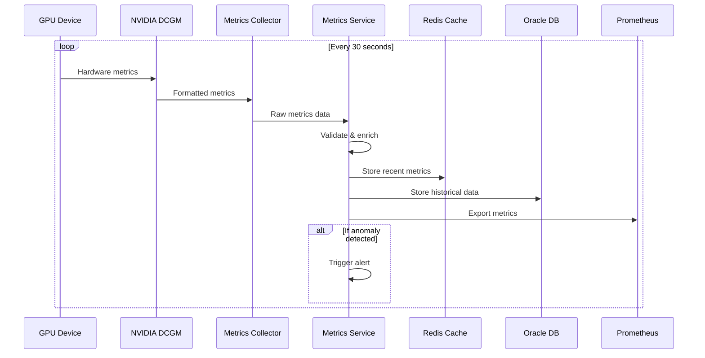

### 3.4 GPU 할당 아키텍처

#### 3.4.1 할당 워크플로우
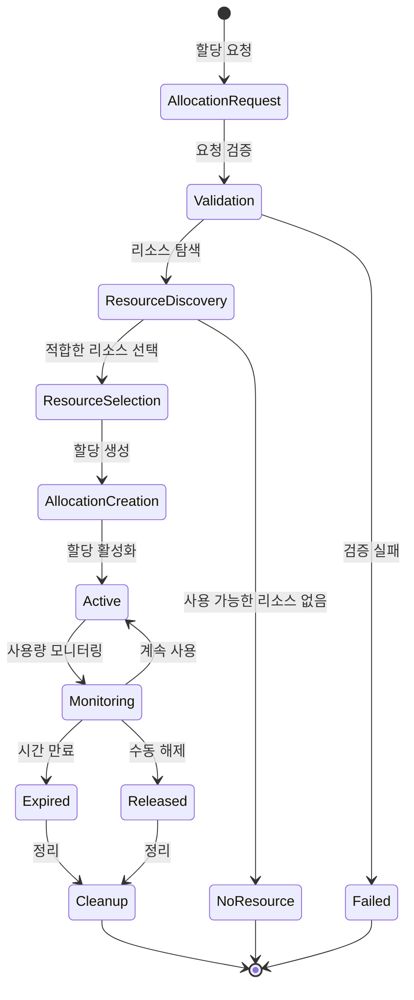

#### 3.4.2 리소스 스케줄링 알고리즘
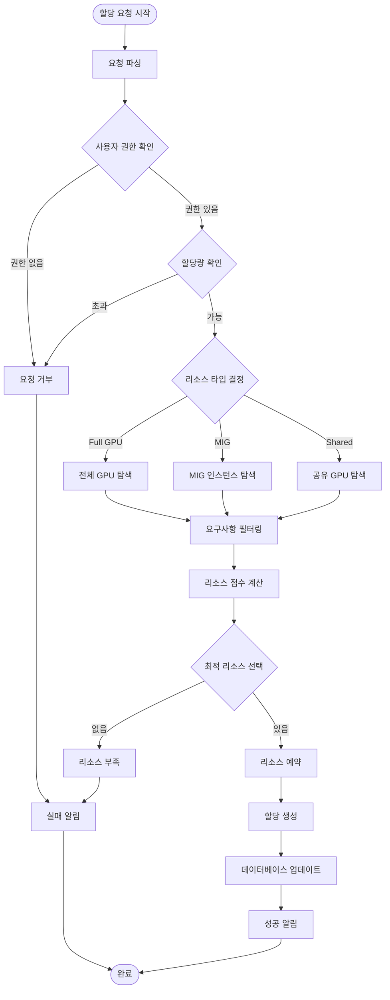

### 3.5 비용 분석 아키텍처

#### 3.5.1 비용 계산 모델
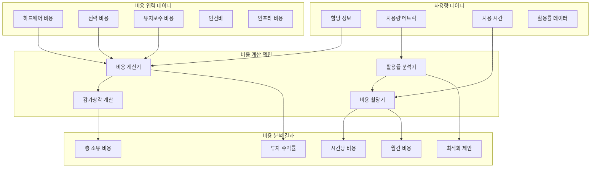

#### 3.5.2 비용 최적화 알고리즘
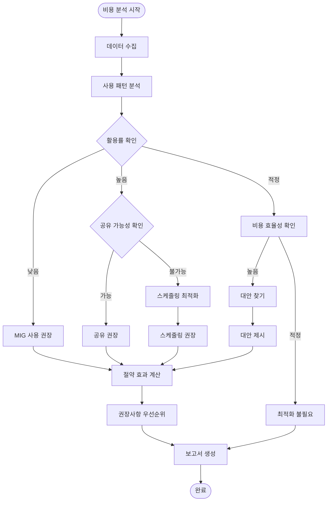

### 3.6 보안 아키텍처

#### 3.6.1 보안 레이어
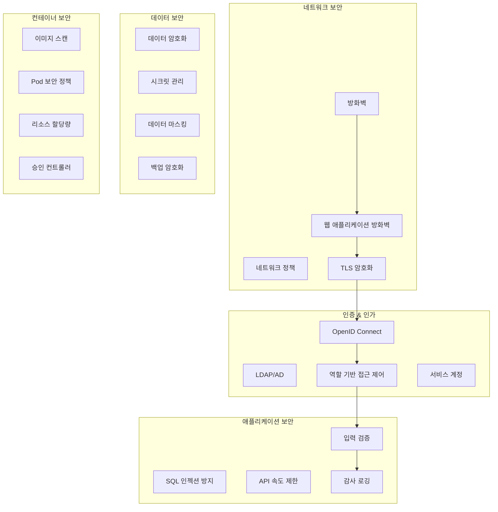

#### 3.6.2 접근 제어 매트릭스
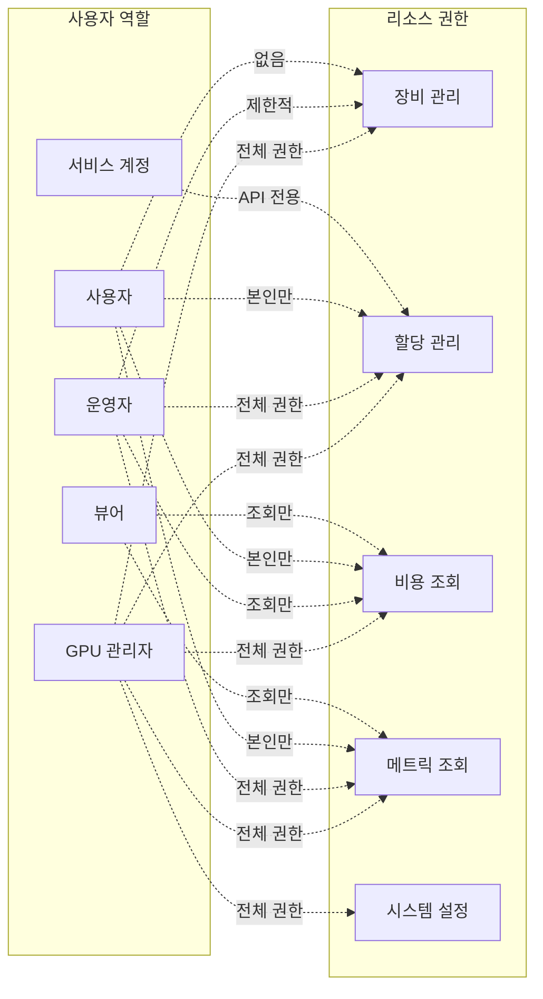

## 4. 배포 아키텍처

### 4.1 Kubernetes 배포 구조
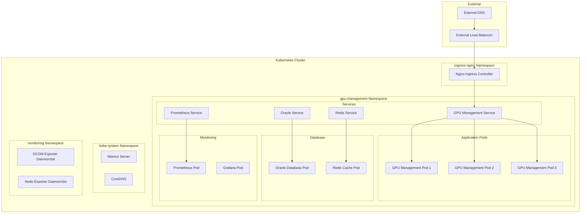

### 4.2 고가용성 구성
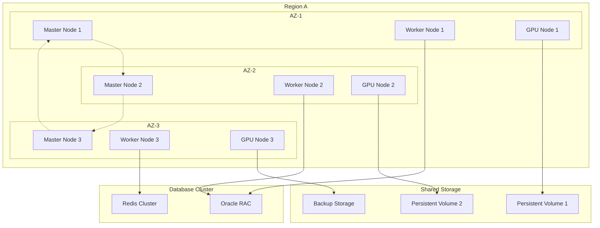

### 4.3 스케일링 전략
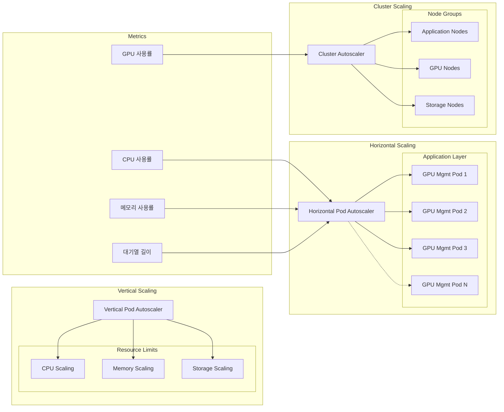

## 5. 성능 최적화

### 5.1 애플리케이션 최적화
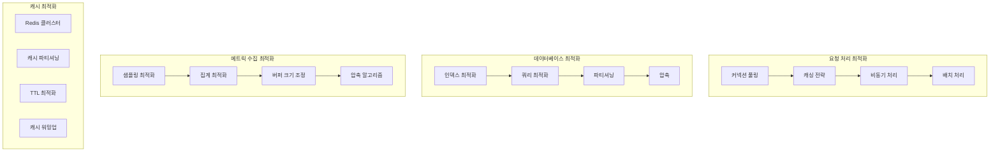

### 5.2 성능 모니터링
```mermaid
graph TB
    subgraph "애플리케이션 메트릭"
        ResponseTime[응답 시간]
        Throughput[처리량]
        ErrorRate[오류율]
        Latency[지연시간]
    end
    
    subgraph "시스템 메트릭"
        CPUUsage[CPU 사용률]
        MemoryUsage[메모리 사용률]
        DiskIO[디스크 I/O]
        NetworkIO[네트워크 I/O]
    end
    
    subgraph "GPU 메트릭"
        GPUUtilization[GPU 사용률]
        GPUMemory[GPU 메모리]
        GPUTemperature[GPU 온도]
        PowerConsumption[전력 소모]
    end
    
    subgraph "비즈니스 메트릭"
        AllocationCount[할당 수]
        CostPerHour[시간당 비용]
        UserSatisfaction[사용자 만족도]
        ResourceEfficiency[리소스 효율성]
    end
    
    subgraph "알림 시스템"
        Alerting[알림 시스템]
        Dashboard[대시보드]
        Reports[보고서]
        Analytics[분석]
    end
    
    %% Monitoring Flow
    ResponseTime --> Alerting
    CPUUsage --> Dashboard
    GPUUtilization --> Analytics
    AllocationCount --> Reports
```

## 6. 장애 복구 및 재해 복구

### 6.1 장애 복구 전략
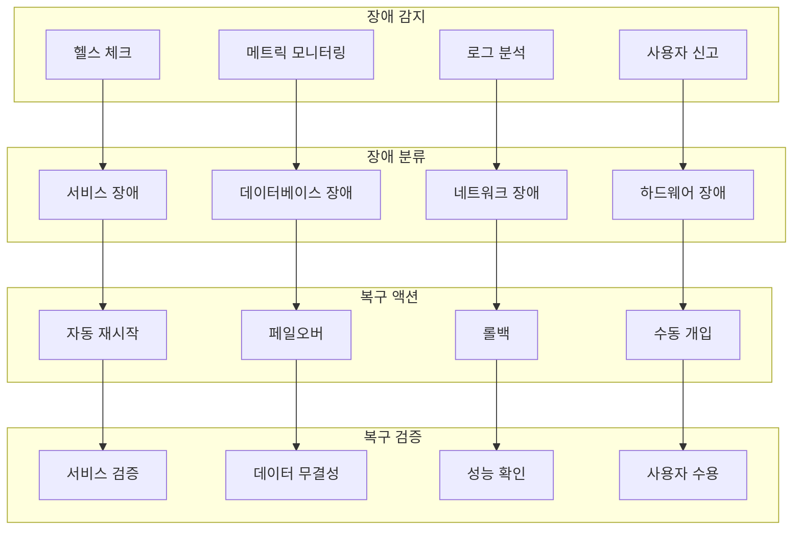

### 6.2 재해 복구 계획
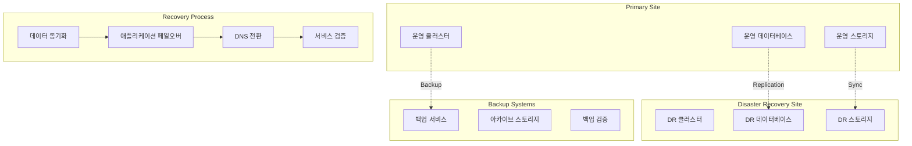

## 7. 확장성 고려사항

### 7.1 수평 확장 설계
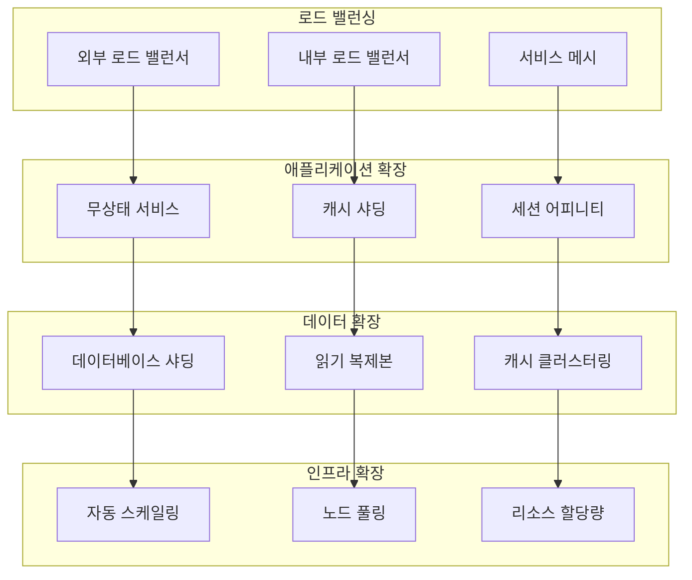

### 7.2 성능 벤치마킹
```mermaid
graph LR
    subgraph "부하 테스트"
        LoadGeneration[부하 생성]
        ConcurrentUsers[동시 사용자]
        RequestRate[요청율]
        DataVolume[데이터 볼륨]
    end
    
    subgraph "성능 측정"
        ResponseTime[응답 시간]
        Throughput[처리량]
        ResourceUtilization[리소스 사용률]
        ErrorRate[오류율]
    end
    
    subgraph "병목점 분석"
        DatabaseBottleneck[데이터베이스 병목]
        NetworkBottleneck[네트워크 병목]
        CPUBottleneck[CPU 병목]
        MemoryBottleneck[메모리 병목]
    end
    
    subgraph "최적화 권장사항"
        ScaleOut[수평 확장]
        ScaleUp[수직 확장]
        Optimization[최적화]
        Caching[캐싱]
    end
    
    %% Benchmark Flow
    LoadGeneration --> ResponseTime
    ConcurrentUsers --> Throughput
    RequestRate --> ResourceUtilization
    DataVolume --> ErrorRate
    
    ResponseTime --> DatabaseBottleneck
    Throughput --> NetworkBottleneck
    ResourceUtilization --> CPUBottleneck
    ErrorRate --> MemoryBottleneck
    
    DatabaseBottleneck --> ScaleOut
    NetworkBottleneck --> ScaleUp
    CPUBottleneck --> Optimization
    MemoryBottleneck --> Caching
```

## 8. 운영 고려사항

### 8.1 모니터링 및 관찰성
```mermaid
graph TB
    subgraph "Observability Stack"
        subgraph "Metrics"
            Prometheus[Prometheus]
            Grafana[Grafana]
            AlertManager[Alert Manager]
        end
        
        subgraph "Logging"
            ELK[ELK Stack]
            Fluentd[Fluentd]
            LogAggregation[로그 집계]
        end
        
        subgraph "Tracing"
            Jaeger[Jaeger]
            OpenTelemetry[OpenTelemetry]
            DistributedTracing[분산 추적]
        end
        
        subgraph "Synthetic Monitoring"
            UptimeChecks[가동시간 확인]
            PerformanceTests[성능 테스트]
            UserJourneyTests[사용자 여정 테스트]
        end
    end
    
    subgraph "Dashboards"
        OperationalDashboard[운영 대시보드]
        BusinessDashboard[비즈니스 대시보드]
        SecurityDashboard[보안 대시보드]
        CapacityDashboard[용량 대시보드]
    end
    
    subgraph "Alerting"
        PagerDuty[PagerDuty]
        Slack[Slack]
        Email[이메일]
        SMS[SMS]
    end
    
    %% Observability Flow
    Prometheus --> OperationalDashboard
    ELK --> SecurityDashboard
    Jaeger --> BusinessDashboard
    UptimeChecks --> CapacityDashboard
    
    AlertManager --> PagerDuty
    AlertManager --> Slack
    AlertManager --> Email
    AlertManager --> SMS
```

### 8.2 운영 자동화
```mermaid
graph TB
    subgraph "배포 자동화"
        CI[Continuous Integration]
        CD[Continuous Deployment]
        GitOps[GitOps]
        BlueGreen[Blue-Green 배포]
    end
    
    subgraph "인프라 자동화"
        IaC[Infrastructure as Code]
        Terraform[Terraform]
        Ansible[Ansible]
        Kubernetes[Kubernetes Operators]
    end
    
    subgraph "운영 자동화"
        AutoScaling[자동 스케일링]
        AutoHealing[자동 복구]
        AutoBackup[자동 백업]
        AutoPatching[자동 패치]
    end
    
    subgraph "보안 자동화"
        VulnerabilityScanning[취약점 스캔]
        ComplianceChecks[컴플라이언스 확인]
        SecurityPatching[보안 패치]
        AccessReview[접근 권한 검토]
    end
    
    %% Automation Flow
    CI --> CD
    CD --> GitOps
    GitOps --> BlueGreen
    
    IaC --> Terraform
    Terraform --> Ansible
    Ansible --> Kubernetes
    
    AutoScaling --> AutoHealing
    AutoHealing --> AutoBackup
    AutoBackup --> AutoPatching
    
    VulnerabilityScanning --> ComplianceChecks
    ComplianceChecks --> SecurityPatching
    SecurityPatching --> AccessReview
```

### 8.3 용량 계획
```mermaid
graph TB
    subgraph "현재 상태 분석"
        CurrentUsage[현재 사용량]
        ResourceUtilization[리소스 활용률]
        GrowthTrends[성장 추세]
        SeasonalPatterns[계절성 패턴]
    end
    
    subgraph "예측 모델링"
        LinearProjection[선형 예측]
        ExponentialGrowth[지수 성장]
        MachineLearning[머신러닝 예측]
        ScenarioAnalysis[시나리오 분석]
    end
    
    subgraph "용량 요구사항"
        ComputeCapacity[연산 용량]
        StorageCapacity[저장 용량]
        NetworkBandwidth[네트워크 대역폭]
        GPUResources[GPU 리소스]
    end
    
    subgraph "계획 실행"
        ProcurementPlan[조달 계획]
        DeploymentSchedule[배포 일정]
        BudgetPlanning[예산 계획]
        RiskAssessment[위험 평가]
    end
    
    %% Capacity Planning Flow
    CurrentUsage --> LinearProjection
    ResourceUtilization --> ExponentialGrowth
    GrowthTrends --> MachineLearning
    SeasonalPatterns --> ScenarioAnalysis
    
    LinearProjection --> ComputeCapacity
    ExponentialGrowth --> StorageCapacity
    MachineLearning --> NetworkBandwidth
    ScenarioAnalysis --> GPUResources
    
    ComputeCapacity --> ProcurementPlan
    StorageCapacity --> DeploymentSchedule
    NetworkBandwidth --> BudgetPlanning
    GPUResources --> RiskAssessment
```

## 9. API 설계 원칙

### 9.1 REST API 설계
```mermaid
graph TB
    subgraph "API 계층"
        subgraph "Public API"
            RESTEndpoints[REST 엔드포인트]
            GraphQLEndpoints[GraphQL 엔드포인트]
            WebSocketEndpoints[WebSocket 엔드포인트]
        end
        
        subgraph "Internal API"
            ServiceAPI[서비스 간 API]
            AdminAPI[관리자 API]
            MetricsAPI[메트릭 API]
        end
    end
    
    subgraph "API Gateway"
        Authentication[인증]
        Authorization[인가]
        RateLimit[속도 제한]
        LoadBalancing[로드 밸런싱]
        Caching[캐싱]
        Monitoring[모니터링]
    end
    
    subgraph "API 관리"
        VersionManagement[버전 관리]
        Documentation[문서화]
        SDKGeneration[SDK 생성]
        Testing[테스트]
    end
    
    %% API Flow
    RESTEndpoints --> Authentication
    GraphQLEndpoints --> Authorization
    WebSocketEndpoints --> RateLimit
    
    ServiceAPI --> LoadBalancing
    AdminAPI --> Caching
    MetricsAPI --> Monitoring
    
    Authentication --> VersionManagement
    RateLimit --> Documentation
    Monitoring --> SDKGeneration
```

### 9.2 API 보안 모델
```mermaid
sequenceDiagram
    participant Client as 클라이언트
    participant Gateway as API Gateway
    participant Auth as 인증 서비스
    participant Service as GPU 서비스
    participant DB as 데이터베이스
    
    Client->>Gateway: API 요청 + JWT 토큰
    Gateway->>Gateway: 요청 검증
    Gateway->>Auth: 토큰 검증
    Auth-->>Gateway: 검증 결과
    
    alt 토큰 유효
        Gateway->>Gateway: 권한 확인
        Gateway->>Service: 요청 전달
        Service->>DB: 데이터 조회/수정
        DB-->>Service: 결과 반환
        Service-->>Gateway: API 응답
        Gateway-->>Client: 응답 반환
    else 토큰 무효
        Gateway-->>Client: 401 Unauthorized
    end
    
    Note over Gateway: 요청/응답 로깅
    Note over Service: 비즈니스 로직 실행
```

## 10. 기술 스택 상세

### 10.1 백엔드 기술 스택
```mermaid
graph TB
    subgraph "Runtime Environment"
        Java17[Java 17 LTS]
        SpringBoot[Spring Boot 3.2]
        JVM[JVM 최적화]
    end
    
    subgraph "Framework & Libraries"
        SpringWeb[Spring Web MVC]
        SpringData[Spring Data JPA]
        SpringSecurity[Spring Security]
        Hibernate[Hibernate ORM]
        Jackson[Jackson JSON]
        Micrometer[Micrometer Metrics]
    end
    
    subgraph "Database & Cache"
        Oracle[Oracle Database 19c]
        Redis[Redis 7.0]
        HikariCP[HikariCP]
        Flyway[Flyway Migration]
    end
    
    subgraph "Monitoring & Observability"
        Prometheus[Prometheus Metrics]
        Grafana[Grafana Dashboard]
        ELK[ELK Stack]
        OpenTelemetry[OpenTelemetry]
    end
    
    %% Tech Stack Relationships
    Java17 --> SpringBoot
    SpringBoot --> SpringWeb
    SpringBoot --> SpringData
    SpringData --> Hibernate
    Hibernate --> Oracle
    
    SpringBoot --> Micrometer
    Micrometer --> Prometheus
    Prometheus --> Grafana
```

### 10.2 프론트엔드 기술 스택
```mermaid
graph TB
    subgraph "Core Technologies"
        HTML5[HTML5]
        CSS3[CSS3]
        JavaScript[JavaScript ES6+]
        WebComponents[Web Components]
    end
    
    subgraph "Styling & UI"
        Responsive[반응형 디자인]
        Flexbox[Flexbox/Grid]
        Animations[CSS 애니메이션]
        Charts[Chart.js/D3.js]
    end
    
    subgraph "API Integration"
        FetchAPI[Fetch API]
        WebSocket[WebSocket]
        EventSource[Server-Sent Events]
        RestClient[REST 클라이언트]
    end
    
    subgraph "Build & Tools"
        Webpack[Webpack]
        Babel[Babel]
        ESLint[ESLint]
        Prettier[Prettier]
    end
    
    %% Frontend Flow
    HTML5 --> Responsive
    CSS3 --> Flexbox
    JavaScript --> FetchAPI
    WebComponents --> Charts
    
    FetchAPI --> RestClient
    WebSocket --> EventSource
    
    Webpack --> Babel
    ESLint --> Prettier
```

### 10.3 인프라 기술 스택
```mermaid
graph TB
    subgraph "Container Orchestration"
        Kubernetes[Kubernetes 1.28+]
        Docker[Docker 24.0+]
        Containerd[Containerd]
        CRIO[CRI-O]
    end
    
    subgraph "Networking"
        Calico[Calico CNI]
        MetalLB[MetalLB]
        Ingress[Nginx Ingress]
        CoreDNS[CoreDNS]
    end
    
    subgraph "Storage"
        Longhorn[Longhorn]
        CSI[CSI Drivers]
        PVC[Persistent Volumes]
        Snapshots[Volume Snapshots]
    end
    
    subgraph "Security"
        CertManager[Cert Manager]
        Falco[Falco]
        OPA[Open Policy Agent]
        KubesecScan[Kubesec]
    end
    
    subgraph "GPU Support"
        NVIDIAOperator[NVIDIA GPU Operator]
        DevicePlugin[Device Plugin]
        DCGM[DCGM Exporter]
        MIG[MIG Manager]
    end
    
    %% Infrastructure Relationships
    Kubernetes --> Docker
    Kubernetes --> Calico
    Kubernetes --> Longhorn
    Kubernetes --> CertManager
    Kubernetes --> NVIDIAOperator
    
    NVIDIAOperator --> DevicePlugin
    NVIDIAOperator --> DCGM
    NVIDIAOperator --> MIG
```

## 11. 미래 확장 계획

### 11.1 로드맵
```mermaid
gantt
    title GPU Management System 로드맵
    dateFormat  YYYY-MM-DD
    section Phase 1
    기본 GPU 관리        :done, phase1, 2024-01-01, 2024-03-31
    MIG 지원            :done, phase1-mig, 2024-02-01, 2024-04-30
    비용 추적           :done, phase1-cost, 2024-03-01, 2024-05-31
    
    section Phase 2
    고급 스케줄링       :active, phase2-sched, 2024-04-01, 2024-06-30
    AI 기반 예측        :phase2-ai, 2024-05-01, 2024-07-31
    멀티 클러스터       :phase2-multi, 2024-06-01, 2024-08-31
    
    section Phase 3
    엣지 컴퓨팅 지원    :phase3-edge, 2024-07-01, 2024-09-30
    ML 워크플로우 통합  :phase3-ml, 2024-08-01, 2024-10-31
    클라우드 네이티브   :phase3-cloud, 2024-09-01, 2024-11-30
    
    section Phase 4
    글로벌 확장         :phase4-global, 2024-10-01, 2024-12-31
    고급 분석           :phase4-analytics, 2024-11-01, 2025-01-31
    에코시스템 통합     :phase4-ecosystem, 2024-12-01, 2025-02-28
```

### 11.2 새로운 기능 아키텍처
```mermaid
graph TB
    subgraph "AI/ML 통합"
        AutoML[AutoML 파이프라인]
        ModelRegistry[모델 레지스트리]
        FeatureStore[피처 스토어]
        ExperimentTracking[실험 추적]
    end
    
    subgraph "멀티 클라우드"
        CloudBroker[클라우드 브로커]
        CostOptimizer[비용 최적화기]
        BurstComputing[버스트 컴퓨팅]
        HybridOrchestrator[하이브리드 오케스트레이터]
    end
    
    subgraph "엣지 컴퓨팅"
        EdgeNodes[엣지 노드]
        EdgeOrchestrator[엣지 오케스트레이터]
        DataSync[데이터 동기화]
        OfflineMode[오프라인 모드]
    end
    
    subgraph "고급 분석"
        RealTimeAnalytics[실시간 분석]
        PredictiveAnalytics[예측 분석]
        AnomalyDetection[이상 탐지]
        BusinessIntelligence[비즈니스 인텔리전스]
    end
    
    %% Future Connections
    AutoML --> ModelRegistry
    CloudBroker --> CostOptimizer
    EdgeNodes --> EdgeOrchestrator
    RealTimeAnalytics --> PredictiveAnalytics
```

### 11.3 기술적 진화
```mermaid
graph LR
    subgraph "현재 상태"
        CurrentArch[모놀리틱 아키텍처]
        BasicGPU[기본 GPU 관리]
        ManualScaling[수동 스케일링]
        ReactiveOps[반응적 운영]
    end
    
    subgraph "단기 목표 (6개월)"
        Microservices[마이크로서비스]
        AdvancedGPU[고급 GPU 관리]
        AutoScaling[자동 스케일링]
        ProactiveOps[능동적 운영]
    end
    
    subgraph "중기 목표 (1년)"
        ServiceMesh[서비스 메시]
        AIOptimized[AI 최적화]
        PredictiveScaling[예측적 스케일링]
        AutonomousOps[자율 운영]
    end
    
    subgraph "장기 목표 (2년)"
        CloudNative[클라우드 네이티브]
        QuantumReady[양자 컴퓨팅 준비]
        SelfHealing[자가 치유]
        IntelligentOps[지능형 운영]
    end
    
    %% Evolution Path
    CurrentArch --> Microservices
    BasicGPU --> AdvancedGPU
    ManualScaling --> AutoScaling
    ReactiveOps --> ProactiveOps
    
    Microservices --> ServiceMesh
    AdvancedGPU --> AIOptimized
    AutoScaling --> PredictiveScaling
    ProactiveOps --> AutonomousOps
    
    ServiceMesh --> CloudNative
    AIOptimized --> QuantumReady
    PredictiveScaling --> SelfHealing
    AutonomousOps --> IntelligentOps
```

## 12. 결론

K8s GPU Management 시스템은 현대적인 클라우드 네이티브 아키텍처를 기반으로 설계되어 다음과 같은 핵심 가치를 제공합니다:

### 12.1 핵심 가치 제안
- **효율성**: GPU 리소스의 최적 활용과 비용 효율성
- **확장성**: 수평적/수직적 확장을 통한 성장 대응
- **안정성**: 고가용성과 장애 복구 메커니즘
- **유연성**: 다양한 워크로드와 환경에 대한 적응성
- **관찰성**: 포괄적인 모니터링과 분석 기능

### 12.2 아키텍처의 장점
1. **모듈화된 설계**: 독립적인 컴포넌트로 구성되어 유지보수성과 확장성 확보
2. **표준 준수**: Kubernetes 네이티브 설계로 생태계 호환성 보장
3. **보안 중심**: 다층 보안 모델로 엔터프라이즈 환경에 적합
4. **성능 최적화**: 캐싱, 비동기 처리, 배치 작업 등으로 고성능 구현
5. **운영 자동화**: DevOps 및 GitOps 기반의 자동화된 운영

### 12.3 지속적인 개선
이 아키텍처는 다음과 같은 방향으로 지속적으로 진화할 예정입니다:
- AI/ML 기반의 지능형 리소스 관리
- 멀티 클라우드 및 하이브리드 환경 지원
- 엣지 컴퓨팅과의 통합
- 실시간 분석 및 예측 기능 강화
- 완전 자율 운영 시스템으로의 발전

이러한 아키텍처를 통해 K8s GPU Management 시스템은 현재의 요구사항을 충족하면서도 미래의 도전과제에 대응할 수 있는 견고하고 유연한 기반을 제공합니다.